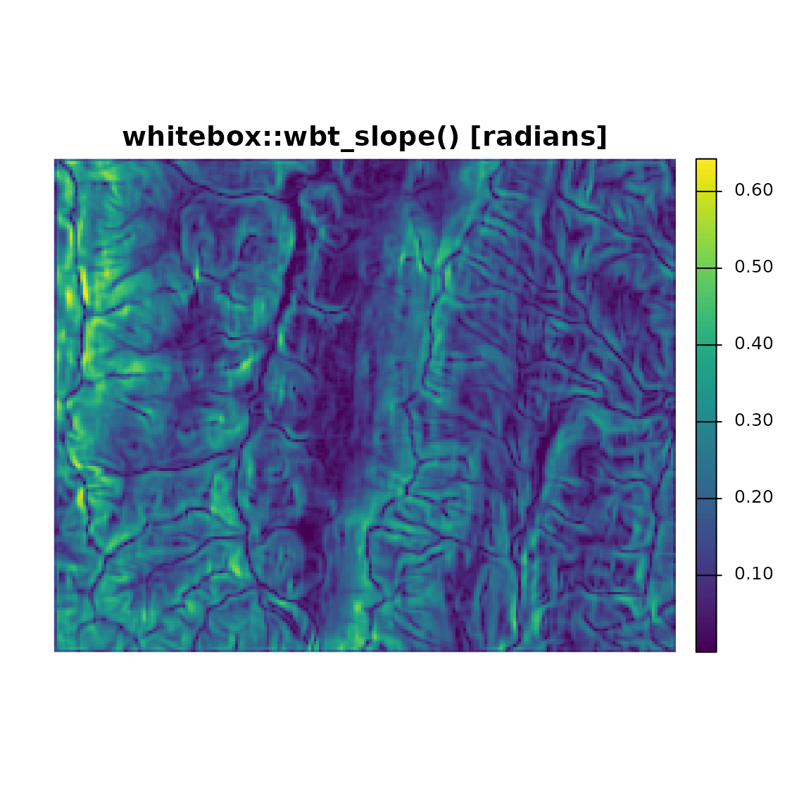
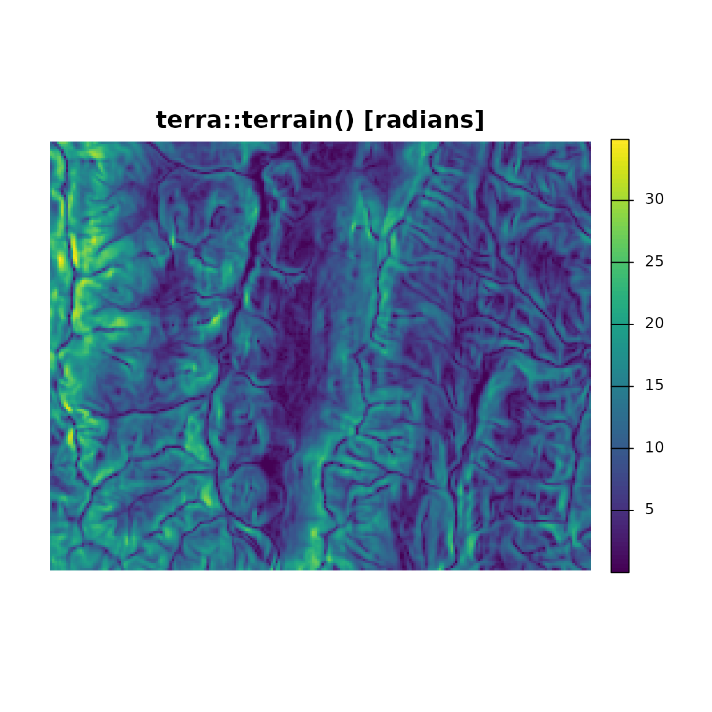
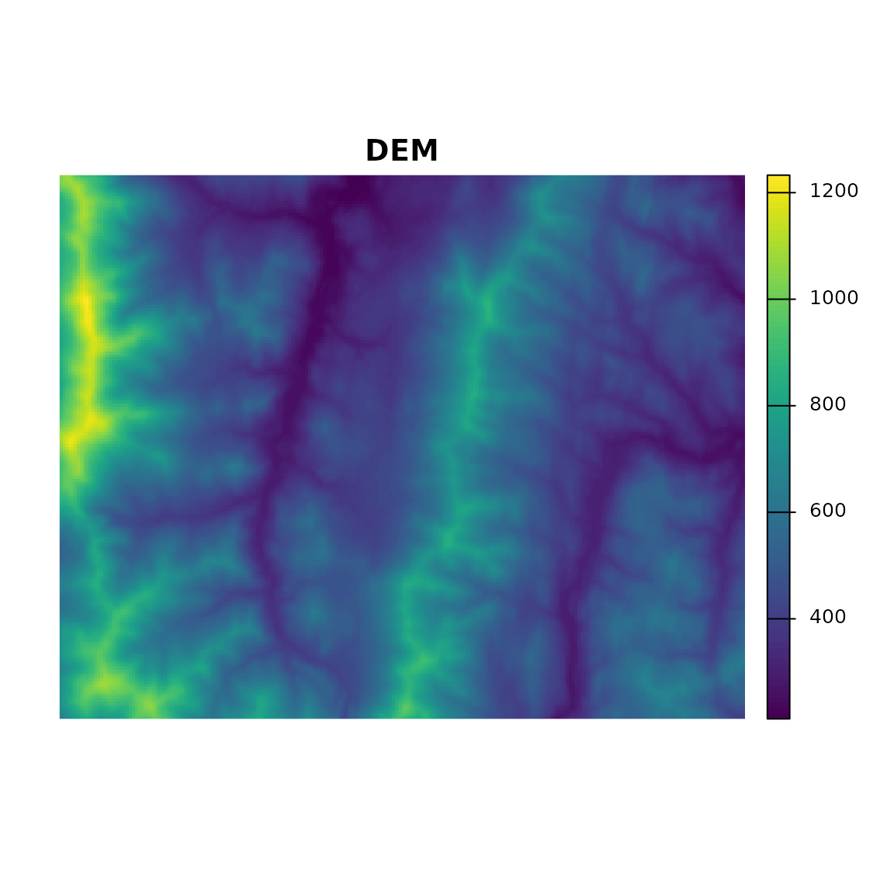
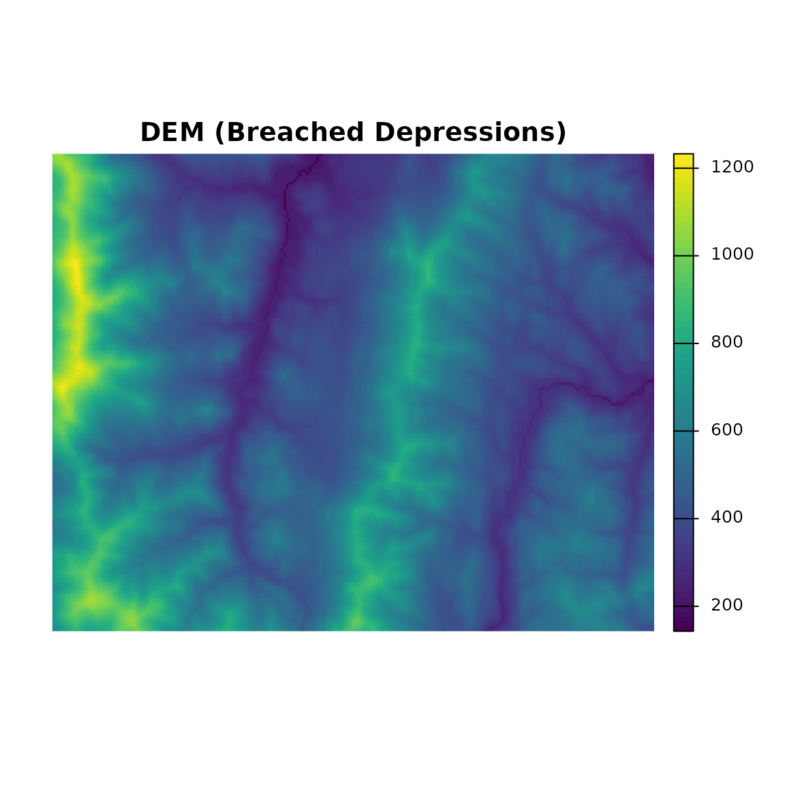
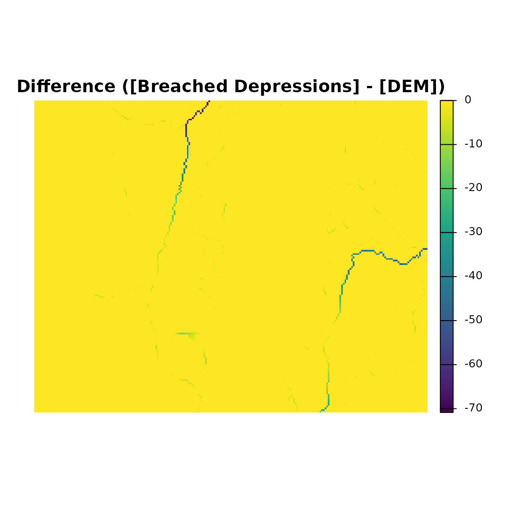
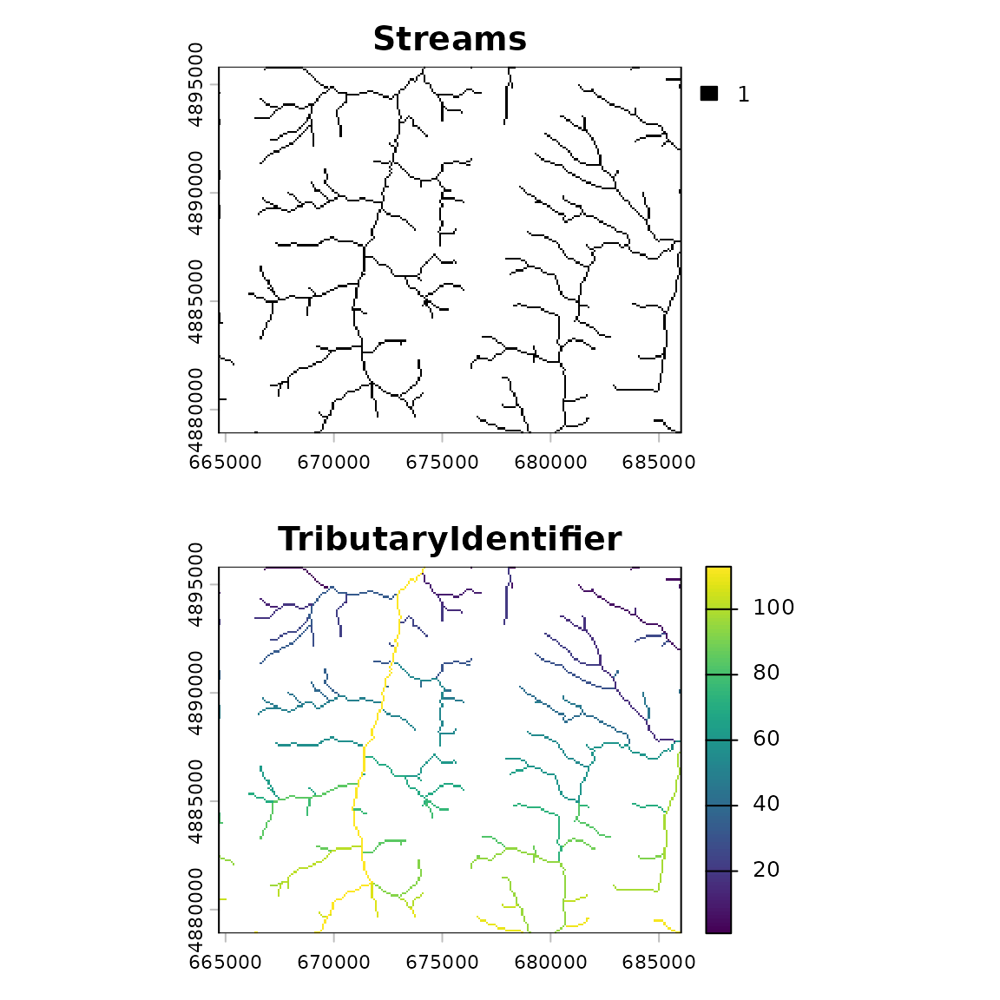

# whitebox Demo

## Introduction

whitebox is an R frontend for the ‘WhiteboxTools’ library, which is an
advanced geospatial data analysis platform developed by Prof. John
Lindsay at the University of Guelph’s Geomorphometry and Hydrogeomatics
Research Group.

‘WhiteboxTools’ can be used to perform common geographical information
systems (GIS) analysis operations, such as cost-distance analysis,
distance buffering, and raster reclassification. Remote sensing and
image processing tasks include image enhancement (e.g. panchromatic
sharpening, contrast adjustments), image mosaicing, numerous filtering
operations, simple classification (k-means), and common image
transformations. ‘WhiteboxTools’ also contains advanced tooling for
spatial hydrological analysis (e.g. flow-accumulation, watershed
delineation, stream network analysis, sink removal), terrain analysis
(e.g. common terrain indices such as slope, curvatures, wetness index,
hillshading; hypsometric analysis; multi-scale topographic position
analysis), and LiDAR data processing.

WhiteboxTools is not a cartographic or spatial data visualization
package; instead it is meant to serve as an analytical backend for other
data visualization software, mainly GIS.

This vignette shows how to use the `whitebox` R package to run
WhiteboxTools.

Suggested citation: Lindsay, J. B. (2016). Whitebox GAT: A case study in
geomorphometric analysis. Computers & Geosciences, 95, 75-84. doi:
<http://dx.doi.org/10.1016/j.cageo.2016.07.003>

## Setup

Load the `whitebox` library.

``` r

library(whitebox)
```

### How `whitebox` works

whitebox generates [`system()`](https://rdrr.io/r/base/system.html)
calls to a local WhiteboxTools binary: `whitebox_tools` or
`whitebox_tools.exe`

You can find the binary path that the package is going to use with
[`wbt_exe_path()`](../reference/wbt_init.md)

``` r

wbt_exe_path(shell_quote = FALSE)
#> [1] "/home/runner/.local/share/R/whitebox/WBT/whitebox_tools"
```

This command always returns a “default” path, whether or not you have
WhiteboxTools installed.

### Interfacing with R spatial packages

WhiteboxTools input and output are specified as file paths to rasters in
GeoTIFF format, shapefiles, HTML output, LiDAR-related files, and more.

In this vignette we will use the `terra` package for visualization. Just
as easily we could have used `raster`, `stars` or other options
available in the R ecosystem for handling the GeoTIFF output.

The main way to view your output is to save “output” file paths as a
variable so that you can use them after processing to load the result
into an R spatial object.

#### Working with Raster Data

A demonstration employing the {terra} package follows:

``` r

library(terra)
#> terra 1.9.30
library(whitebox)

# DEMO: calculate slope with WhiteboxTools and raster

# Typically the input/output paths are stored as variables

# sample DEM input GeoTIFF
input <- sample_dem_data()

# output file (to be created)
output <- file.path(tempdir(), "slope.tif")
```

Run a tool such as [`wbt_slope()`](../reference/wbt_slope.md) or
`"Slope"`.

WhiteboxTools reads from `input` and writes to `output`.

``` r

wbt_slope(input, output, units = 'radians')
```

``` r

if (file.exists(output)) {
  # create a SpatRaster from file output path
  outputras <- terra::rast(output)
}
```

In this case, we can achieve a similar slope map result using
[`terra::terrain()`](https://rspatial.github.io/terra/reference/terrain.html),
so we will create and plot a SpatRaster from `output` and compare the
two.

``` r

if (file.exists(input) && file.exists(output) && !is.null(outputras)) {
  # par(mfrow = c(2, 1), mar = c(1, 1, 1, 1))
  
  # inspect the output graphically
  plot(
    outputras,
    main = "whitebox::wbt_slope() [radians]",
    axes = FALSE
  )
  
  # calculate equivalent using raster::terrain() on input
  plot(
    terra::terrain(terra::rast(input)),
    main = "terra::terrain() [radians]",
    axes = FALSE
  )
}
```



The `SpatRaster`, `RasterLayer` and related classes in the terra and
raster packages are perfect for maintaining the linkage between file
output and an R object with the data in or out of memory.

Use
[`terra::sources()`](https://rspatial.github.io/terra/reference/sources.html)
to get the “source” file name(s). If you are using a raster
`RasterLayer` objects the equivalent method is
[`raster::filename()`](https://rdrr.io/pkg/raster/man/filename.html).

``` r

# the SpatRaster retains a reference to the input file name
terra::sources(outputras)
#> [1] "/tmp/RtmpkaDWz2/slope.tif"
```

### WhiteboxTools R setup

### Installing WhiteboxTools

In `whitebox` [`wbt_init()`](../reference/wbt_init.md) is the standard
way to set the “exe_path” for a session.

If you do not have WhiteboxTools installed in the default location, do
not have `whitebox_tools` on your PATH, and have not set up your package
options, the package will not be able to find your WhiteboxTools
installation on load.

Usually you can use
[`whitebox::install_whitebox()`](../reference/install_whitebox.md) to
download the latest binaries that correspond to the available version of
the R package. However, this is not required. You may download/compile
WhiteboxTools yourself and install anywhere for use with the `whitebox`
R package.

For general information consult the WhiteboxTools User Manual:
<https://www.whiteboxgeo.com/manual/wbt_book/install.html>

For more details on building from source see:
<https://github.com/jblindsay/whitebox-tools>

### Package Settings with `wbt_init()`

[`wbt_init()`](../reference/wbt_init.md) is used to set and check the
path of the binary executable that commands are passed to.

The executable path and other options are stored as package options, and
can be overridden by system environment variables. A default value
`wbt_exe_path(shell_quote = FALSE)` is passed when the `exe_path`
argument is unspecified.

``` r

# inspect where wbt_init() will be checking
wbt_exe_path(shell_quote = FALSE)
#> [1] "/home/runner/.local/share/R/whitebox/WBT/whitebox_tools"

# TRUE when file is found at one of the user specified paths or package default
# FALSE when whitebox_tools does not exist at path
wbt_init()
```

This section will cover optional arguments to
[`wbt_init()`](../reference/wbt_init.md) (`exe_path`, `wd` and
`verbose`) and their corresponding options and helper functions.

#### `exe_path` argument

The `exe_path` argument to [`wbt_init()`](../reference/wbt_init.md) sets
the `whitebox.exe_path` package option. `exe_path` is the path to a
WhiteboxTools executable file. The default value is the package
installation directory, subdirectory `"WBT"`, followed by
`whitebox_tools.exe` or `whitebox_tools` depending on your operating
system.

``` r

# set path manually to whitebox_tools executable, for instance:
wbt_init(exe_path = '/home/andrew/workspace/whitebox-tools/target/release/whitebox_tools')
```

The package will automatically find an existing installation when
`whitebox_tools` is in a directory on your PATH.

Package options other than `exe_path` (as detailed in
[`?whitebox::whitebox`](../reference/whitebox-package.md) and
[`?wbt_init`](../reference/wbt_init.md)) can be set with
`wbt_init(exe_path, ...)`, where `...` is additional named arguments
corresponding to the `*` suffix in `whitebox.*` package options names.
Use [`wbt_options()`](../reference/wbt_init.md) or specific methods like
[`wbt_verbose()`](../reference/wbt_init.md),
[`wbt_wd()`](../reference/wbt_init.md) to get all values or set specific
values.

#### `wd` argument

The `wd` argument can be used to set the WhiteboxTools working
directory.

A working directory specifies a base folder path where WhiteboxTools can
find inputs and create outputs. Setting the `whitebox.wd` package option
(via the `wd` argument to [`wbt_init()`](../reference/wbt_init.md) or
[`wbt_wd()`](../reference/wbt_init.md)) aids the process of setting file
paths. If a value is set for the option the `--wd` directory flag is
added for tools that support it.

Before you set the working directory in a session the default output
will be in your current R working directory unless directory is
specified in your input/output arguments. You can change working
directory at any time by setting the `wd` argument to
[`wbt_wd()`](../reference/wbt_init.md) and running a tool.

NOTE: once you have set a working directory in a session, the directory
needs to be set somewhere new to “replace” the old value; just dropping
the flag will **not** automatically change the working directory *back
to your R working directory*\* and your output will show up in whatever
folder you set initially.

A helper method for setting the `whitebox.wd` option is
[`wbt_wd()`](../reference/wbt_init.md).

To “unset” the option in the R package you can use `wbt_wd("")` which is
equivalent to `wbt_wd(getwd())`. The next tool call will change the
WhiteboxTools working directory setting to the new path. After this
point the flag need not be specified \[until you wish to change again\].

``` r

wbt_wd("") # "" equivalent to getwd()
```

#### `verbose` argument

The `verbose` argument is used to set the package option related to tool
“verbosity”: `whitebox.verbose`. When `whitebox.verbose` is `FALSE` no
output will be [`cat()`](https://rdrr.io/r/base/cat.html) to the console
by running tools.

A helper method for getting and setting the `whitebox.verbose` option is
[`wbt_verbose()`](../reference/wbt_init.md).
[`wbt_verbose()`](../reference/wbt_init.md) is used throughout the
package to check what level of verbosity should be used.

By default, the result of [`wbt_verbose()`](../reference/wbt_init.md) is
the result of [`interactive()`](https://rdrr.io/r/base/interactive.html)
so tools will print extra console output when you are there to see it.
This is used in a variety of `wbt_*` methods to allow the package option
to control output for many functions in a consistent manner, hide output
in your automated tests, markdown documents, vignettes etc.

In this vignette we use `wbt_verbose(TRUE)` so the package option
`whitebox.verbose` is set to `TRUE`

``` r

# force output when run non-interactively (knitr)
wbt_verbose(TRUE)
```

This is mainly to print out the tool name and elapsed time whenever we
run a tool:

    #> wbt_breach_depressions - Elapsed Time (excluding I/O): 0.12s

This package-level verbose option can also control the `verbose_mode`
values passed to `wbt_*` tool functions. Turning on “full” output
requires a third option to be set for this argument: `"all"`. Use
`wbt_verbose("all")`. [`wbt_verbose()`](../reference/wbt_init.md) will
still return `TRUE` when the `whitebox.verbose` option is `"all"`.

### Long-term Package Option Settings

The package will detect when you have added the WhiteboxTools directory
to your `PATH` environment variable. For long-term package option
settings you can put `whitebox_tools` on `$PATH` or set
`R_WHITEBOX_EXE_PATH` in your user `.Rprofile` or `.Renviron`.

On Windows you can add the path to `whitebox_tools.exe` as a new entry
`R_WHITEBOX_EXE_PATH` in User or System Environment variable.

On Linux/Mac you can set `R_WHITEBOX_EXE_PATH` directly with
`export R_WHITEBOX_EXE_PATH="/path/to/whitebox_tools"`.

- Note that if you set your `$PATH` in you regular shell profile
  (`.profile`/`.bashrc`/`.zshrc`) then it will *not* be sourced by
  *RStudio* for your R session by default.

This requires that you have the Unix tool `which` or one of its
analogues.

You can also set `R_WHITEBOX_EXE_PATH` manually in R:

``` r

Sys.setenv(R_WHITEBOX_EXE_PATH = Sys.which("whitebox_tools"))
```

- Replace the [`Sys.which()`](https://rdrr.io/r/base/Sys.which.html)
  call with a custom path string as needed such as
  `"C:/path/to/whitebox_tools.exe"`.

All of the other package options can similarly be set as environment
variables. They are prefixed with `R_WHITEBOX_*`. See
[`?whitebox`](../reference/whitebox-package.md) for details.

## Running tools

Specify input and output paths, and any other options, as specified in
package reference:

- <https://whiteboxR.gishub.org/reference/index.html>

For instance, “BreachDepressions” is used below to process a Digital
Elevation Model (DEM) before we identify flow pathways. This tool uses
uses Lindsay’s (2016) algorithm, which is preferred over depression
filling in most cases.

``` r

# sample DEM file path in package extdata folder
input <- sample_dem_data()

# output file name
output <- file.path(tempdir(), "output.tif")

# run breach_depressions tool
wbt_breach_depressions(dem = input, output = output)
#> breach_depressions - Elapsed Time (excluding I/O): 0.7s
```

For more info see:
[`?wbt_breach_depressions`](../reference/wbt_breach_depressions.md)

These `wbt_*_tool_name_*()` functions are wrappers around the
[`wbt_run_tool()`](../reference/wbt_run_tool.md) function that does the
[`system()`](https://rdrr.io/r/base/system.html) call given a
function-specific argument string.

``` r

# sample DEM file path in package extdata folder
input <- sample_dem_data()

# output file name
output <- file.path(tempdir(), "output.tif")

# run breach_depressions tool
wbt_run_tool(tool_name = "BreachDepressions", args = paste0("--dem=", input, " --output=", output))
#> BreachDepressions - Elapsed Time (excluding I/O): 0.7s
```

The above method of creating
`wbt_breach_depressions(dem = ..., output = ...)` to handle
`wbt_run_tool("BreachDepressions", args = ...)` makes it easy to
generate static methods that have parity with the latest WhiteboxTools
interface.

### Example: Compare input v.s. output with `terra`

We use the {terra} package to read the GeoTIFF file output by
WhiteboxTools.

#### Setup

``` r

library(terra)

# sample DEM file path in package extdata folder
input <- sample_dem_data()

# output file name
output <- file.path(tempdir(), "output.tif")
```

#### Run `wbt_breach_depressions()` (BreachDepressions tool)

``` r

# run breach_depressions tool
wbt_breach_depressions(dem = input, output = output)
#> breach_depressions - Elapsed Time (excluding I/O): 0.7s
```

#### Visualize results with `terra`

``` r

# create raster object from input file
input <- rast(input)

if (file.exists(output)) {
  # create raster object from output file
  output <- rast(output)
  
  # par(mar = c(2, 1, 2, 1))
  # inspect input v.s. output
  plot(input, axes = FALSE, main = "DEM")
  plot(output, axes = FALSE, main = "DEM (Breached Depressions)")
  
  # inspect numeric difference (output - input) 
  plot(output - input, axes = FALSE,  main = "Difference ([Breached Depressions] - [DEM])")
}
```



### Example: Identifying Tributaries

Here we will take our processing of DEMs a bit further by performing
several WhiteboxTools operations in sequence.

We are interested in identifying and ranking tributaries of watercourses
(streams and rivers).

An R package that makes use of the `whitebox` R package is
[hydroweight](https://github.com/GLFC-WET/hydroweight). Here is a brief
example on the beginning of the `hydroweight` README showing how the
breached DEM above can be used in a spatial analysis of stream networks.

#### Setup

``` r

library(whitebox)
library(terra)

## Sample DEM from whitebox package
toy_file <- sample_dem_data()
toy_dem <- rast(x = toy_file)

## Generate wd as a temporary directory. 
## Replace with your own path, or "." for current directory
wd <- tempdir()

## Write toy_dem to working directory
writeRaster(
  x = toy_dem, filename = file.path(wd, "toy_dem.tif"),
  overwrite = TRUE
)
```

#### `wbt_breach_depressions()` – Breach DEM Depressions

First we pre-process by breaching depressions in the DEM

``` r

## Breach depressions to ensure continuous flow
wbt_breach_depressions(
  dem = file.path(wd, "toy_dem.tif"),
  output = file.path(wd, "toy_dem_breached.tif")
)
#> breach_depressions - Elapsed Time (excluding I/O): 0.7s
```

#### `wbt_d8_pointer()` – Calculate Flow Direction

Then we generate the direction of flow on the DEM surface using the “D8”
flow pointer method

``` r

## Generate d8 flow pointer (note: other flow directions are available)
wbt_d8_pointer(
  dem = file.path(wd, "toy_dem_breached.tif"),
  output = file.path(wd, "toy_dem_breached_d8.tif")
)
#> d8_pointer - Elapsed Time (excluding I/O): 0.2s
```

#### `wbt_d8_flow_accumulation()` – Flow Accumulation

Once we calculate the direction of flow by some method, we calculate
cumulative flow

For example with
[`wbt_d8_flow_accumulation()`](../reference/wbt_d8_flow_accumulation.md):

``` r

## Generate d8 flow accumulation in units of cells (note: other flow directions are available)
wbt_d8_flow_accumulation(
  input = file.path(wd, "toy_dem_breached.tif"),
  output = file.path(wd, "toy_dem_breached_accum.tif"),
  out_type = "cells"
)
#> d8_flow_accumulation - Elapsed Time (excluding I/O): 0.4s
```

##### Additional Flow Direction and Accumulation Tools

In addition to D8 flow pointers (flow direction), there are several
other options for both direction and accumulation such as FD8,
D-infinity, and D-infinity.

- Keyword “Pointer” tools: `"D8Pointer"`, `"DInfPointer"`,
  `"FD8Pointer"`, `"Rho8Pointer"`

- Keyword “FlowAccumulation” tools: `"D8FlowAccumulation"`,
  `"DInfFlowAccumulation"`, `"FD8FlowAccumulation"`,
  `"Rho8FlowAccumulation"`, `"MDInfFlowAccumulation"`

Search for more tools involving `"flow pointer"` by key word:
`wbt_list_tools(keyword = "flow pointer")`

    #> All 27 Tools containing keywords:
    #> AverageFlowpathSlope: Measures the average slope gradient from each grid cell to all upslope divide cells.
    #> AverageUpslopeFlowpathLength: Measures the average length of all upslope flowpaths draining each grid cell.
    #> D8FlowAccumulation: Calculates a D8 flow accumulation raster from an input DEM or flow pointer.
    #> D8Pointer: Calculates a D8 flow pointer raster from an input DEM.
    #> DInfFlowAccumulation: Calculates a D-infinity flow accumulation raster from an input DEM.
    #> DInfPointer: Calculates a D-infinity flow pointer (flow direction) raster from an input DEM.
    #> DownslopeFlowpathLength: Calculates the downslope flowpath length from each cell to basin outlet.
    #> ExtractStreams: Extracts stream grid cells from a flow accumulation raster.
    #> FD8FlowAccumulation: Calculates an FD8 flow accumulation raster from an input DEM.
    #> FD8Pointer: Calculates an FD8 flow pointer raster from an input DEM.
    #> FindNoFlowCells: Finds grid cells with no downslope neighbours.
    #> FindParallelFlow: Finds areas of parallel flow in D8 flow direction rasters.
    #> FlowAccumulationFullWorkflow: Resolves all of the depressions in a DEM, outputting a breached DEM, an aspect-aligned non-divergent flow pointer, and a flow accumulation raster.
    #> FlowLengthDiff: Calculates the local maximum absolute difference in downslope flowpath length, useful in mapping drainage divides and ridges.
    #> LongProfileFromPoints: Plots the longitudinal profiles from flow-paths initiating from a set of vector points.
    #> LongestFlowpath: Delineates the longest flowpaths for a group of subbasins or watersheds. 
    #> MDInfFlowAccumulation: Calculates an FD8 flow accumulation raster from an input DEM.
    #> MaxUpslopeFlowpathLength: Measures the maximum length of all upslope flowpaths draining each grid cell.
    #> NumInflowingNeighbours: Computes the number of inflowing neighbours to each cell in an input DEM based on the D8 algorithm.
    #> Rho8Pointer: Calculates a stochastic Rho8 flow pointer raster from an input DEM.
    #> SnapPourPoints: Moves outlet points used to specify points of interest in a watershedding operation to the cell with the highest flow accumulation in its neighbourhood.
    #> TraceDownslopeFlowpaths: Traces downslope flowpaths from one or more target sites (i.e. seed points).
    #> Rho8FlowAccumulation: Calculates Fairfield and Leymarie (1991) flow accumulation.
    #> MaxUpslopeValue: Calculates the maximum upslope value from an input values raster along flowpaths.
    #> QuinnFlowAccumulation: Calculates Quinn et al. (1995) flow accumulation.
    #> ConvergenceIndex: Calculates Qin et al. (2007) flow accumulation.
    #> QinFlowAccumulation: Calculates Qin et al. (2007) flow accumulation.

This is just an example of the wealth of tool options made available by
the WhiteboxTools platform.

#### `wbt_extract_streams()` – Extract Stream Network

With our flow accumulation raster in hand, we can extract a stream
network with
[`wbt_extract_streams()`](../reference/wbt_extract_streams.md) based on
a threshold (e.g. `100`) of accumulated flow. This threshold value you
choose will depend on analysis goals, the choice of flow accumulation
algorithm used, local topography, as well as resolution and extent of
DEM.

``` r

## Generate streams with a stream initiation threshold of 100 cells
wbt_extract_streams(
  flow_accum = file.path(wd, "toy_dem_breached_accum.tif"),
  output = file.path(wd, "toy_dem_streams.tif"),
  threshold = 100
)
#> extract_streams - Elapsed Time (excluding I/O): 0.1s
```

#### `wbt_tributary_identifier()` – Identify Tributaries

Next, let’s identify tributaries. This function
[`wbt_tributary_identifier()`](../reference/wbt_tributary_identifier.md)
is a little more complicated because it takes takes two inputs:

- Our raster D8 pointer file.

- And our raster streams file.

``` r

wbt_tributary_identifier(
  d8_pntr = file.path(wd, "toy_dem_breached_d8.tif"),
  streams = file.path(wd, "toy_dem_streams.tif"),
  output = file.path(wd, "toy_dem_tributaries.tif")
)
#> tributary_identifier - Elapsed Time (excluding I/O): 0.1s
```

#### Compare results

Finally, we compare results of
[`wbt_extract_streams()`](../reference/wbt_extract_streams.md) with
[`wbt_tributary_identifier()`](../reference/wbt_tributary_identifier.md)

``` r

if (file.exists(file.path(wd, "toy_dem_streams.tif"))) {
  par(mfrow = c(2, 1), mar = c(3, 1, 2, 1))
  
  plot(
    rast(file.path(wd, "toy_dem_streams.tif")),
    main = "Streams",
    col = "black"
  )
  
  plot(
    rast(file.path(wd, "toy_dem_tributaries.tif")),
    main = "TributaryIdentifier"
  )
}
```



## Appendix: `wbt_*` utility functions

These methods provide access to WhiteboxTools executable parameters and
metadata.

### `wbt_help()`

[`wbt_help()`](../reference/wbt_help.md) prints the WhiteboxTools help:
a listing of available commands for executable

``` r

wbt_help()
#> WhiteboxTools Help
#> 
#> The following commands are recognized:
#> --cd, --wd          Changes the working directory; used in conjunction with --run flag.
#> --compress_rasters  Sets the compress_raster option in the settings.json file; determines if newly created rasters are compressed. e.g. --compress_rasters=true
#> -h, --help          Prints help information.
#> -l, --license       Prints the whitebox-tools license. Tool names may also be used, --license="Slope"
#> --listtools         Lists all available tools. Keywords may also be used, --listtools slope.
#> --max_procs         Sets the maximum number of processors used. -1 = all available processors. e.g. --max_procs=2
#> -r, --run           Runs a tool; used in conjunction with --wd flag; -r="LidarInfo".
#> --toolbox           Prints the toolbox associated with a tool; --toolbox=Slope.
#> --toolhelp          Prints the help associated with a tool; --toolhelp="LidarInfo".
#> --toolparameters    Prints the parameters (in json form) for a specific tool; --toolparameters="LidarInfo".
#> -v                  Verbose mode. Without this flag, tool outputs will not be printed.
#> --viewcode          Opens the source code of a tool in a web browser; --viewcode="LidarInfo".
#> --version           Prints the version information.
#> 
#> Example Usage:
#> >> ./whitebox_tools -r=lidar_info --cd="/path/to/data/" -i=input.las --vlr --geokeys
```

### `wbt_license()`

[`wbt_license()`](../reference/wbt_license.md) prints the WhiteboxTools
license

``` r

wbt_license()
#> WhiteboxTools License
#> Copyright 2017-2023 John Lindsay
#> 
#> Permission is hereby granted, free of charge, to any person obtaining a copy of this software and
#> associated documentation files (the "Software"), to deal in the Software without restriction,
#> including without limitation the rights to use, copy, modify, merge, publish, distribute, sublicense,
#> and/or sell copies of the Software, and to permit persons to whom the Software is furnished to do so,
#> subject to the following conditions:
#> 
#> The above copyright notice and this permission notice shall be included in all copies or substantial
#> portions of the Software.
#> 
#> THE SOFTWARE IS PROVIDED "AS IS", WITHOUT WARRANTY OF ANY KIND, EXPRESS OR IMPLIED, INCLUDING BUT
#> NOT LIMITED TO THE WARRANTIES OF MERCHANTABILITY, FITNESS FOR A PARTICULAR PURPOSE AND
#> NONINFRINGEMENT. IN NO EVENT SHALL THE AUTHORS OR COPYRIGHT HOLDERS BE LIABLE FOR ANY CLAIM, DAMAGES
#> OR OTHER LIABILITY, WHETHER IN AN ACTION OF CONTRACT, TORT OR OTHERWISE, ARISING FROM, OUT OF OR IN
#> CONNECTION WITH THE SOFTWARE OR THE USE OR OTHER DEALINGS IN THE SOFTWARE.
```

### `wbt_version()`

Prints the WhiteboxTools version

``` r

wbt_version()
#> WhiteboxTools v2.4.0 (c) Dr. John Lindsay 2017-2023
#> 
#> WhiteboxTools is an advanced geospatial data analysis platform developed at
#> the University of Guelph's Geomorphometry and Hydrogeomatics Research 
#> Group (GHRG). See www.whiteboxgeo.com for more details.
```

### `wbt_list_tools()`

Use [`wbt_list_tools()`](../reference/wbt_list_tools.md) to list all
available tools in WhiteboxTools. In version 2.4.0 there are over 484
tools! See all the available
[toolboxes](https://www.whiteboxgeo.com/manual/wbt_book/available_tools/index.html)
and
[extensions](https://www.whiteboxgeo.com/whitebox-geospatial-extensions/).

``` r

wbt_list_tools()
```

The full list can be an overwhelming amount of output, so you pass the
`keywords` argument to search and filter.

For example we list tools with keyword ‘flowaccumulation’ in tool name
or description.

``` r

wbt_list_tools(keywords = "flowaccumulation")
#> All 8 Tools containing keywords:
#> D8FlowAccumulation: Calculates a D8 flow accumulation raster from an input DEM or flow pointer.
#> DInfFlowAccumulation: Calculates a D-infinity flow accumulation raster from an input DEM.
#> FD8FlowAccumulation: Calculates an FD8 flow accumulation raster from an input DEM.
#> FlowAccumulationFullWorkflow: Resolves all of the depressions in a DEM, outputting a breached DEM, an aspect-aligned non-divergent flow pointer, and a flow accumulation raster.
#> MDInfFlowAccumulation: Calculates an FD8 flow accumulation raster from an input DEM.
#> QuinnFlowAccumulation: Calculates Quinn et al. (1995) flow accumulation.
#> Rho8FlowAccumulation: Calculates Fairfield and Leymarie (1991) flow accumulation.
#> QinFlowAccumulation: Calculates Qin et al. (2007) flow accumulation.
```

### `wbt_tool_help()`

Once we find a tool that we are interested in using, we can investigate
what sort of parameters it takes. The R methods generally take the same
named parameters.

R functions have the naming scheme `wbt_tool_name` where `_` is used for
spaces, whereas the tools themselves have no spaces.

`wbt_tool_help("tributaryidentifier")` shows the command line help for a
tool by name.

``` r

wbt_tool_help("tributaryidentifier")
#> TributaryIdentifier
#> Description:
#> Assigns a unique identifier to each tributary in a stream network.
#> Toolbox: Stream Network Analysis
#> Parameters:
#> 
#> Flag               Description
#> -----------------  -----------
#> --d8_pntr          Input raster D8 pointer file.
#> --streams          Input raster streams file.
#> -o, --output       Output raster file.
#> --esri_pntr        D8 pointer uses the ESRI style scheme.
#> --zero_background  Flag indicating whether a background value of zero should be used.
#> 
#> 
#> Example usage:
#> >>./whitebox_tools -r=TributaryIdentifier -v --wd="/path/to/data/" --d8_pntr=D8.tif --streams=streams.tif -o=output.tif
#> >>./whitebox_tools -r=TributaryIdentifier -v --wd="/path/to/data/" --d8_pntr=D8.tif --streams=streams.tif -o=output.tif --esri_pntr --zero_background
```

[`?wbt_tributary_identifier`](../reference/wbt_tributary_identifier.md)
shows the corresponding R function help, which is derived from the
command line help page and other metadata.

### `wbt_toolbox()`

Another way that tools are organized in WhiteboxTools is by “toolbox.”

[`wbt_toolbox()`](../reference/wbt_toolbox.md) prints the toolbox for a
specific tool (or all tools if none specified)

``` r

wbt_toolbox(tool_name = "aspect")
#> Geomorphometric Analysis
```

Print the full list by not specifying `tool_name`

``` r

wbt_toolbox()
#> AbsoluteValue: Math and Stats Tools
#> AdaptiveFilter: Image Processing Tools/Filters
#> Add: Math and Stats Tools
#> AddPointCoordinatesToTable: Data Tools
#> AggregateRaster: GIS Analysis
#> And: Math and Stats Tools
#> Anova: Math and Stats Tools
#> ArcCos: Math and Stats Tools
#> ArcSin: Math and Stats Tools
#> ArcTan: Math and Stats Tools
#> Arcosh: Math and Stats Tools
#> Arsinh: Math and Stats Tools
#> Artanh: Math and Stats Tools
#> AsciiToLas: LiDAR Tools
#> Aspect: Geomorphometric Analysis
#> Atan2: Math and Stats Tools
#> AttributeCorrelation: Math and Stats Tools
#> AttributeCorrelationNeighbourhoodAnalysis: Math and Stats Tools
#> AttributeHistogram: Math and Stats Tools
#> AttributeScattergram: Math and Stats Tools
#> AverageFlowpathSlope: Hydrological Analysis
#> AverageNormalVectorAngularDeviation: Geomorphometric Analysis
#> AverageOverlay: GIS Analysis/Overlay Tools
#> AverageUpslopeFlowpathLength: Hydrological Analysis
#> BalanceContrastEnhancement: Image Processing Tools/Image Enhancement
#> Basins: Hydrological Analysis
#> BilateralFilter: Image Processing Tools/Filters
#> BlockMaximumGridding: GIS Analysis
#> BlockMinimumGridding: GIS Analysis
#> BoundaryShapeComplexity: GIS Analysis/Patch Shape Tools
#> BreachDepressions: Hydrological Analysis
#> BreachDepressionsLeastCost: Hydrological Analysis
#> BreachSingleCellPits: Hydrological Analysis
#> BufferRaster: GIS Analysis/Distance Tools
#> BurnStreamsAtRoads: Hydrological Analysis
#> Ceil: Math and Stats Tools
#> Centroid: GIS Analysis
#> CentroidVector: GIS Analysis
#> ChangeVectorAnalysis: Image Processing Tools
#> CircularVarianceOfAspect: Geomorphometric Analysis
#> ClassifyBuildingsInLidar: LiDAR Tools
#> ClassifyOverlapPoints: LiDAR Tools
#> CleanVector: Data Tools
#> Clip: GIS Analysis/Overlay Tools
#> ClipLidarToPolygon: LiDAR Tools
#> ClipRasterToPolygon: GIS Analysis/Overlay Tools
#> Closing: Image Processing Tools
#> Clump: GIS Analysis
#> CompactnessRatio: GIS Analysis/Patch Shape Tools
#> ConditionalEvaluation: Math and Stats Tools
#> ConditionedLatinHypercube: Math and Stats Tools
#> ConservativeSmoothingFilter: Image Processing Tools/Filters
#> ConstructVectorTIN: GIS Analysis
#> ContoursFromPoints: Geomorphometric Analysis
#> ContoursFromRaster: Geomorphometric Analysis
#> ConvergenceIndex: Geomorphometric Analysis
#> ConvertNodataToZero: Data Tools
#> ConvertRasterFormat: Data Tools
#> CornerDetection: Image Processing Tools/Filters
#> CorrectStreamVectorDirection: Stream Network Analysis
#> CorrectVignetting: Image Processing Tools/Image Enhancement
#> Cos: Math and Stats Tools
#> Cosh: Math and Stats Tools
#> CostAllocation: GIS Analysis/Distance Tools
#> CostDistance: GIS Analysis/Distance Tools
#> CostPathway: GIS Analysis/Distance Tools
#> CountIf: GIS Analysis/Overlay Tools
#> CreateColourComposite: Image Processing Tools
#> CreateHexagonalVectorGrid: GIS Analysis
#> CreatePlane: GIS Analysis
#> CreateRectangularVectorGrid: GIS Analysis
#> CrispnessIndex: Math and Stats Tools
#> CrossTabulation: Math and Stats Tools
#> CsvPointsToVector: Data Tools
#> CumulativeDistribution: Math and Stats Tools
#> D8FlowAccumulation: Hydrological Analysis
#> D8MassFlux: Hydrological Analysis
#> D8Pointer: Hydrological Analysis
#> DInfFlowAccumulation: Hydrological Analysis
#> DInfMassFlux: Hydrological Analysis
#> DInfPointer: Hydrological Analysis
#> Decrement: Math and Stats Tools
#> DepthInSink: Hydrological Analysis
#> DevFromMeanElev: Geomorphometric Analysis
#> DeviationFromRegionalDirection: GIS Analysis/Patch Shape Tools
#> DiffFromMeanElev: Geomorphometric Analysis
#> DiffOfGaussianFilter: Image Processing Tools/Filters
#> Difference: GIS Analysis/Overlay Tools
#> DirectDecorrelationStretch: Image Processing Tools/Image Enhancement
#> DirectionalRelief: Geomorphometric Analysis
#> Dissolve: GIS Analysis
#> DistanceToOutlet: Stream Network Analysis
#> DiversityFilter: Image Processing Tools/Filters
#> Divide: Math and Stats Tools
#> DownslopeDistanceToStream: Hydrological Analysis
#> DownslopeFlowpathLength: Hydrological Analysis
#> DownslopeIndex: Geomorphometric Analysis
#> EdgeContamination: Hydrological Analysis
#> EdgeDensity: Geomorphometric Analysis
#> EdgePreservingMeanFilter: Image Processing Tools/Filters
#> EdgeProportion: GIS Analysis/Patch Shape Tools
#> ElevAbovePit: Geomorphometric Analysis
#> ElevPercentile: Geomorphometric Analysis
#> ElevRelativeToMinMax: Geomorphometric Analysis
#> ElevRelativeToWatershedMinMax: Geomorphometric Analysis
#> ElevationAboveStream: Hydrological Analysis
#> ElevationAboveStreamEuclidean: Hydrological Analysis
#> EliminateCoincidentPoints: GIS Analysis
#> ElongationRatio: GIS Analysis/Patch Shape Tools
#> EmbankmentMapping: Geomorphometric Analysis
#> EmbossFilter: Image Processing Tools/Filters
#> EqualTo: Math and Stats Tools
#> Erase: GIS Analysis/Overlay Tools
#> ErasePolygonFromLidar: LiDAR Tools
#> ErasePolygonFromRaster: GIS Analysis/Overlay Tools
#> EuclideanAllocation: GIS Analysis/Distance Tools
#> EuclideanDistance: GIS Analysis/Distance Tools
#> Exp: Math and Stats Tools
#> Exp2: Math and Stats Tools
#> ExportTableToCsv: Data Tools
#> ExposureTowardsWindFlux: Geomorphometric Analysis
#> ExtendVectorLines: GIS Analysis
#> ExtractByAttribute: GIS Analysis
#> ExtractNodes: GIS Analysis
#> ExtractRasterValuesAtPoints: GIS Analysis
#> ExtractStreams: Stream Network Analysis
#> ExtractValleys: Stream Network Analysis
#> FD8FlowAccumulation: Hydrological Analysis
#> FD8Pointer: Hydrological Analysis
#> FarthestChannelHead: Stream Network Analysis
#> FastAlmostGaussianFilter: Image Processing Tools/Filters
#> FeaturePreservingSmoothing: Geomorphometric Analysis
#> FetchAnalysis: Geomorphometric Analysis
#> FillBurn: Hydrological Analysis
#> FillDepressions: Hydrological Analysis
#> FillDepressionsPlanchonAndDarboux: Hydrological Analysis
#> FillDepressionsWangAndLiu: Hydrological Analysis
#> FillMissingData: Geomorphometric Analysis
#> FillSingleCellPits: Hydrological Analysis
#> FilterLidarClasses: LiDAR Tools
#> FilterLidarScanAngles: LiDAR Tools
#> FilterRasterFeaturesByArea: GIS Analysis
#> FindFlightlineEdgePoints: LiDAR Tools
#> FindLowestOrHighestPoints: GIS Analysis
#> FindMainStem: Stream Network Analysis
#> FindNoFlowCells: Hydrological Analysis
#> FindParallelFlow: Hydrological Analysis
#> FindPatchOrClassEdgeCells: GIS Analysis/Patch Shape Tools
#> FindRidges: Geomorphometric Analysis
#> FlattenLakes: Hydrological Analysis
#> FlightlineOverlap: LiDAR Tools
#> FlipImage: Image Processing Tools
#> FloodOrder: Hydrological Analysis
#> Floor: Math and Stats Tools
#> FlowAccumulationFullWorkflow: Hydrological Analysis
#> FlowLengthDiff: Hydrological Analysis
#> GammaCorrection: Image Processing Tools/Image Enhancement
#> GaussianContrastStretch: Image Processing Tools/Image Enhancement
#> GaussianCurvature: Geomorphometric Analysis
#> GaussianFilter: Image Processing Tools/Filters
#> GaussianScaleSpace: Geomorphometric Analysis
#> Geomorphons: Geomorphometric Analysis
#> GreaterThan: Math and Stats Tools
#> HackStreamOrder: Stream Network Analysis
#> HeatMap: GIS Analysis
#> HeightAboveGround: LiDAR Tools
#> HighPassBilateralFilter: Image Processing Tools/Filters
#> HighPassFilter: Image Processing Tools/Filters
#> HighPassMedianFilter: Image Processing Tools/Filters
#> HighestPosition: GIS Analysis/Overlay Tools
#> Hillshade: Geomorphometric Analysis
#> Hillslopes: Hydrological Analysis
#> HistogramEqualization: Image Processing Tools/Image Enhancement
#> HistogramMatching: Image Processing Tools/Image Enhancement
#> HistogramMatchingTwoImages: Image Processing Tools/Image Enhancement
#> HoleProportion: GIS Analysis/Patch Shape Tools
#> HorizonAngle: Geomorphometric Analysis
#> HortonStreamOrder: Stream Network Analysis
#> HypsometricAnalysis: Geomorphometric Analysis
#> HypsometricallyTintedHillshade: Geomorphometric Analysis
#> IdwInterpolation: GIS Analysis
#> IhsToRgb: Image Processing Tools
#> ImageAutocorrelation: Math and Stats Tools
#> ImageCorrelation: Math and Stats Tools
#> ImageCorrelationNeighbourhoodAnalysis: Math and Stats Tools
#> ImageRegression: Math and Stats Tools
#> ImageStackProfile: Image Processing Tools
#> ImpoundmentSizeIndex: Hydrological Analysis
#> InPlaceAdd: Math and Stats Tools
#> InPlaceDivide: Math and Stats Tools
#> InPlaceMultiply: Math and Stats Tools
#> InPlaceSubtract: Math and Stats Tools
#> Increment: Math and Stats Tools
#> IndividualTreeDetection: LiDAR Tools
#> InsertDams: Hydrological Analysis
#> InstallWbExtension: Whitebox Utilities
#> IntegerDivision: Math and Stats Tools
#> IntegralImage: Image Processing Tools
#> Intersect: GIS Analysis/Overlay Tools
#> IsNoData: Math and Stats Tools
#> Isobasins: Hydrological Analysis
#> JensonSnapPourPoints: Hydrological Analysis
#> JoinTables: Data Tools
#> KMeansClustering: Machine Learning
#> KNearestMeanFilter: Image Processing Tools/Filters
#> KappaIndex: Math and Stats Tools
#> KsTestForNormality: Math and Stats Tools
#> LaplacianFilter: Image Processing Tools/Filters
#> LaplacianOfGaussianFilter: Image Processing Tools/Filters
#> LasToAscii: LiDAR Tools
#> LasToMultipointShapefile: LiDAR Tools
#> LasToShapefile: LiDAR Tools
#> LasToZlidar: LiDAR Tools
#> LaunchWbRunner: Whitebox Utilities
#> LayerFootprint: GIS Analysis
#> LeeSigmaFilter: Image Processing Tools/Filters
#> LengthOfUpstreamChannels: Stream Network Analysis
#> LessThan: Math and Stats Tools
#> LidarBlockMaximum: LiDAR Tools
#> LidarBlockMinimum: LiDAR Tools
#> LidarClassifySubset: LiDAR Tools
#> LidarColourize: LiDAR Tools
#> LidarDigitalSurfaceModel: LiDAR Tools
#> LidarElevationSlice: LiDAR Tools
#> LidarGroundPointFilter: LiDAR Tools
#> LidarHexBinning: LiDAR Tools
#> LidarHillshade: LiDAR Tools
#> LidarHistogram: LiDAR Tools
#> LidarIdwInterpolation: LiDAR Tools
#> LidarInfo: LiDAR Tools
#> LidarJoin: LiDAR Tools
#> LidarKappaIndex: LiDAR Tools
#> LidarNearestNeighbourGridding: LiDAR Tools
#> LidarPointDensity: LiDAR Tools
#> LidarPointStats: LiDAR Tools
#> LidarRansacPlanes: LiDAR Tools
#> LidarRbfInterpolation: LiDAR Tools
#> LidarRemoveDuplicates: LiDAR Tools
#> LidarRemoveOutliers: LiDAR Tools
#> LidarRooftopAnalysis: LiDAR Tools
#> LidarSegmentation: LiDAR Tools
#> LidarSegmentationBasedFilter: LiDAR Tools
#> LidarShift: LiDAR Tools
#> LidarTINGridding: LiDAR Tools
#> LidarThin: LiDAR Tools
#> LidarThinHighDensity: LiDAR Tools
#> LidarTile: LiDAR Tools
#> LidarTileFootprint: LiDAR Tools
#> LidarTophatTransform: LiDAR Tools
#> LineDetectionFilter: Image Processing Tools/Filters
#> LineIntersections: GIS Analysis/Overlay Tools
#> LineThinning: Image Processing Tools
#> LinearityIndex: GIS Analysis/Patch Shape Tools
#> LinesToPolygons: Data Tools
#> ListUniqueValues: Math and Stats Tools
#> ListUniqueValuesRaster: Math and Stats Tools
#> Ln: Math and Stats Tools
#> LocalQuadraticRegression: Geomorphometric Analysis
#> Log10: Math and Stats Tools
#> Log2: Math and Stats Tools
#> LongProfile: Stream Network Analysis
#> LongProfileFromPoints: Stream Network Analysis
#> LongestFlowpath: Hydrological Analysis
#> LowestPosition: GIS Analysis/Overlay Tools
#> MDInfFlowAccumulation: Hydrological Analysis
#> MajorityFilter: Image Processing Tools/Filters
#> MapOffTerrainObjects: Geomorphometric Analysis
#> Max: Math and Stats Tools
#> MaxAbsoluteOverlay: GIS Analysis/Overlay Tools
#> MaxAnisotropyDev: Geomorphometric Analysis
#> MaxAnisotropyDevSignature: Geomorphometric Analysis
#> MaxBranchLength: Geomorphometric Analysis
#> MaxDifferenceFromMean: Geomorphometric Analysis
#> MaxDownslopeElevChange: Geomorphometric Analysis
#> MaxElevDevSignature: Geomorphometric Analysis
#> MaxElevationDeviation: Geomorphometric Analysis
#> MaxOverlay: GIS Analysis/Overlay Tools
#> MaxUpslopeElevChange: Geomorphometric Analysis
#> MaxUpslopeFlowpathLength: Hydrological Analysis
#> MaxUpslopeValue: Hydrological Analysis
#> MaximalCurvature: Geomorphometric Analysis
#> MaximumFilter: Image Processing Tools/Filters
#> MeanCurvature: Geomorphometric Analysis
#> MeanFilter: Image Processing Tools/Filters
#> MedianFilter: Image Processing Tools/Filters
#> Medoid: GIS Analysis
#> MergeLineSegments: GIS Analysis/Overlay Tools
#> MergeTableWithCsv: Data Tools
#> MergeVectors: Data Tools
#> Min: Math and Stats Tools
#> MinAbsoluteOverlay: GIS Analysis/Overlay Tools
#> MinDownslopeElevChange: Geomorphometric Analysis
#> MinMaxContrastStretch: Image Processing Tools/Image Enhancement
#> MinOverlay: GIS Analysis/Overlay Tools
#> MinimalCurvature: Geomorphometric Analysis
#> MinimumBoundingBox: GIS Analysis
#> MinimumBoundingCircle: GIS Analysis
#> MinimumBoundingEnvelope: GIS Analysis
#> MinimumConvexHull: GIS Analysis
#> MinimumFilter: Image Processing Tools/Filters
#> ModifiedKMeansClustering: Machine Learning
#> ModifyNoDataValue: Data Tools
#> Modulo: Math and Stats Tools
#> Mosaic: Image Processing Tools
#> MosaicWithFeathering: Image Processing Tools
#> MultiPartToSinglePart: Data Tools
#> MultidirectionalHillshade: Geomorphometric Analysis
#> Multiply: Math and Stats Tools
#> MultiplyOverlay: GIS Analysis/Overlay Tools
#> MultiscaleElevationPercentile: Geomorphometric Analysis
#> MultiscaleRoughness: Geomorphometric Analysis
#> MultiscaleRoughnessSignature: Geomorphometric Analysis
#> MultiscaleStdDevNormals: Geomorphometric Analysis
#> MultiscaleStdDevNormalsSignature: Geomorphometric Analysis
#> MultiscaleTopographicPositionImage: Geomorphometric Analysis
#> NarrownessIndex: GIS Analysis/Patch Shape Tools
#> NaturalNeighbourInterpolation: GIS Analysis
#> NearestNeighbourGridding: GIS Analysis
#> Negate: Math and Stats Tools
#> NewRasterFromBase: Data Tools
#> NormalVectors: LiDAR Tools
#> NormalizeLidar: LiDAR Tools
#> NormalizedDifferenceIndex: Image Processing Tools
#> Not: Math and Stats Tools
#> NotEqualTo: Math and Stats Tools
#> NumDownslopeNeighbours: Geomorphometric Analysis
#> NumInflowingNeighbours: Hydrological Analysis
#> NumUpslopeNeighbours: Geomorphometric Analysis
#> OlympicFilter: Image Processing Tools/Filters
#> Opening: Image Processing Tools
#> Or: Math and Stats Tools
#> OtsuThresholding: Image Processing Tools
#> PairedSampleTTest: Math and Stats Tools
#> PanchromaticSharpening: Image Processing Tools/Image Enhancement
#> PatchOrientation: GIS Analysis/Patch Shape Tools
#> PennockLandformClass: Geomorphometric Analysis
#> PercentElevRange: Geomorphometric Analysis
#> PercentEqualTo: GIS Analysis/Overlay Tools
#> PercentGreaterThan: GIS Analysis/Overlay Tools
#> PercentLessThan: GIS Analysis/Overlay Tools
#> PercentageContrastStretch: Image Processing Tools/Image Enhancement
#> PercentileFilter: Image Processing Tools/Filters
#> PerimeterAreaRatio: GIS Analysis/Patch Shape Tools
#> PickFromList: GIS Analysis/Overlay Tools
#> PlanCurvature: Geomorphometric Analysis
#> PolygonArea: GIS Analysis
#> PolygonLongAxis: GIS Analysis
#> PolygonPerimeter: GIS Analysis
#> PolygonShortAxis: GIS Analysis
#> Polygonize: GIS Analysis/Overlay Tools
#> PolygonsToLines: Data Tools
#> Power: Math and Stats Tools
#> PrewittFilter: Image Processing Tools/Filters
#> PrincipalComponentAnalysis: Math and Stats Tools
#> PrintGeoTiffTags: Data Tools
#> Profile: Geomorphometric Analysis
#> ProfileCurvature: Geomorphometric Analysis
#> QinFlowAccumulation: Hydrological Analysis
#> Quantiles: Math and Stats Tools
#> QuinnFlowAccumulation: Hydrological Analysis
#> RadialBasisFunctionInterpolation: GIS Analysis
#> RadiusOfGyration: GIS Analysis/Patch Shape Tools
#> RaiseWalls: Hydrological Analysis
#> RandomField: Math and Stats Tools
#> RandomSample: Math and Stats Tools
#> RangeFilter: Image Processing Tools/Filters
#> RasterArea: GIS Analysis
#> RasterCalculator: Math and Stats Tools
#> RasterCellAssignment: GIS Analysis
#> RasterHistogram: Math and Stats Tools
#> RasterPerimeter: GIS Analysis
#> RasterStreamsToVector: Stream Network Analysis
#> RasterSummaryStats: Math and Stats Tools
#> RasterToVectorLines: Data Tools
#> RasterToVectorPoints: Data Tools
#> RasterToVectorPolygons: Data Tools
#> RasterizeStreams: Stream Network Analysis
#> Reciprocal: Math and Stats Tools
#> Reclass: GIS Analysis
#> ReclassEqualInterval: GIS Analysis
#> ReclassFromFile: GIS Analysis
#> ReinitializeAttributeTable: Data Tools
#> RelatedCircumscribingCircle: GIS Analysis/Patch Shape Tools
#> RelativeAspect: Geomorphometric Analysis
#> RelativeTopographicPosition: Geomorphometric Analysis
#> RemoveOffTerrainObjects: Geomorphometric Analysis
#> RemovePolygonHoles: Data Tools
#> RemoveShortStreams: Stream Network Analysis
#> RemoveSpurs: Image Processing Tools
#> RepairStreamVectorTopology: Stream Network Analysis
#> Resample: Image Processing Tools
#> RescaleValueRange: Math and Stats Tools
#> RgbToIhs: Image Processing Tools
#> Rho8FlowAccumulation: Hydrological Analysis
#> Rho8Pointer: Hydrological Analysis
#> RobertsCrossFilter: Image Processing Tools/Filters
#> RootMeanSquareError: Math and Stats Tools
#> Round: Math and Stats Tools
#> RuggednessIndex: Geomorphometric Analysis
#> ScharrFilter: Image Processing Tools/Filters
#> SedimentTransportIndex: Geomorphometric Analysis
#> SelectTilesByPolygon: LiDAR Tools
#> SetNodataValue: Data Tools
#> ShapeComplexityIndex: GIS Analysis/Patch Shape Tools
#> ShapeComplexityIndexRaster: GIS Analysis/Patch Shape Tools
#> ShreveStreamMagnitude: Stream Network Analysis
#> SigmoidalContrastStretch: Image Processing Tools/Image Enhancement
#> Sin: Math and Stats Tools
#> SinglePartToMultiPart: Data Tools
#> Sinh: Math and Stats Tools
#> Sink: Hydrological Analysis
#> Slope: Geomorphometric Analysis
#> SlopeVsElevationPlot: Geomorphometric Analysis
#> SmoothVectors: GIS Analysis
#> SnapPourPoints: Hydrological Analysis
#> SobelFilter: Image Processing Tools/Filters
#> SphericalStdDevOfNormals: Geomorphometric Analysis
#> SplitColourComposite: Image Processing Tools
#> SplitVectorLines: GIS Analysis
#> SplitWithLines: GIS Analysis/Overlay Tools
#> Square: Math and Stats Tools
#> SquareRoot: Math and Stats Tools
#> StandardDeviationContrastStretch: Image Processing Tools/Image Enhancement
#> StandardDeviationFilter: Image Processing Tools/Filters
#> StandardDeviationOfSlope: Geomorphometric Analysis
#> StochasticDepressionAnalysis: Hydrological Analysis
#> StrahlerOrderBasins: Hydrological Analysis
#> StrahlerStreamOrder: Stream Network Analysis
#> StreamLinkClass: Stream Network Analysis
#> StreamLinkIdentifier: Stream Network Analysis
#> StreamLinkLength: Stream Network Analysis
#> StreamLinkSlope: Stream Network Analysis
#> StreamPowerIndex: Geomorphometric Analysis
#> StreamSlopeContinuous: Stream Network Analysis
#> Subbasins: Hydrological Analysis
#> Subtract: Math and Stats Tools
#> SumOverlay: GIS Analysis/Overlay Tools
#> SurfaceAreaRatio: Geomorphometric Analysis
#> SymmetricalDifference: GIS Analysis/Overlay Tools
#> TINGridding: GIS Analysis
#> Tan: Math and Stats Tools
#> TangentialCurvature: Geomorphometric Analysis
#> Tanh: Math and Stats Tools
#> ThickenRasterLine: Image Processing Tools
#> TimeInDaylight: Geomorphometric Analysis
#> ToDegrees: Math and Stats Tools
#> ToRadians: Math and Stats Tools
#> TophatTransform: Image Processing Tools
#> TopographicHachures: Geomorphometric Analysis
#> TopologicalStreamOrder: Stream Network Analysis
#> TotalCurvature: Geomorphometric Analysis
#> TotalFilter: Image Processing Tools/Filters
#> TraceDownslopeFlowpaths: Hydrological Analysis
#> TravellingSalesmanProblem: GIS Analysis
#> TrendSurface: Math and Stats Tools
#> TrendSurfaceVectorPoints: Math and Stats Tools
#> TributaryIdentifier: Stream Network Analysis
#> Truncate: Math and Stats Tools
#> TurningBandsSimulation: Math and Stats Tools
#> TwoSampleKsTest: Math and Stats Tools
#> Union: GIS Analysis/Overlay Tools
#> UnnestBasins: Hydrological Analysis
#> UnsharpMasking: Image Processing Tools/Filters
#> UpdateNodataCells: GIS Analysis/Overlay Tools
#> UpslopeDepressionStorage: Hydrological Analysis
#> UserDefinedWeightsFilter: Image Processing Tools/Filters
#> VectorHexBinning: GIS Analysis
#> VectorLinesToRaster: Data Tools
#> VectorPointsToRaster: Data Tools
#> VectorPolygonsToRaster: Data Tools
#> VectorStreamNetworkAnalysis: Stream Network Analysis
#> Viewshed: Geomorphometric Analysis
#> VisibilityIndex: Geomorphometric Analysis
#> VoronoiDiagram: GIS Analysis
#> Watershed: Hydrological Analysis
#> WeightedOverlay: GIS Analysis/Overlay Tools
#> WeightedSum: GIS Analysis/Overlay Tools
#> WetnessIndex: Geomorphometric Analysis
#> WilcoxonSignedRankTest: Math and Stats Tools
#> WriteFunctionMemoryInsertion: Image Processing Tools
#> Xor: Math and Stats Tools
#> ZScores: Math and Stats Tools
#> ZlidarToLas: LiDAR Tools
#> ZonalStatistics: Math and Stats Tools
```

### `wbt_tool_parameters()`

[`wbt_tool_parameters()`](../reference/wbt_tool_parameters.md) retrieves
the tool parameter descriptions for a specific tool as JSON formatted
string.

``` r

wbt_tool_parameters("slope")
#> {"parameters": [{"name":"Input DEM File","flags":["-i","--dem"],"description":"Input raster DEM file.","parameter_type":{"ExistingFile":"Raster"},"default_value":null,"optional":false},{"name":"Output File","flags":["-o","--output"],"description":"Output raster file.","parameter_type":{"NewFile":"Raster"},"default_value":null,"optional":false},{"name":"Z Conversion Factor","flags":["--zfactor"],"description":"Optional multiplier for when the vertical and horizontal units are not the same.","parameter_type":"Float","default_value":null,"optional":true},{"name":"Units","flags":["--units"],"description":"Units of output raster; options include 'degrees', 'radians', 'percent'","parameter_type":{"OptionList":["degrees","radians","percent"]},"default_value":"degrees","optional":true}]}
```

### `wbt_view_code()`

WhiteboxTools is written in Rust and is open source. You can view the
source code for a specific tool on the source code repository.

``` r

wbt_view_code("breach_depressions")
#> https://github.com/jblindsay/whitebox-tools/blob/master/whitebox-tools-app/src/tools/hydro_analysis/breach_depressions.rs
```

Use the argument `viewer=TRUE` to use
[`browseURL()`](https://rdrr.io/r/utils/browseURL.html) to open a
browser window to the corresponding GitHub page.
